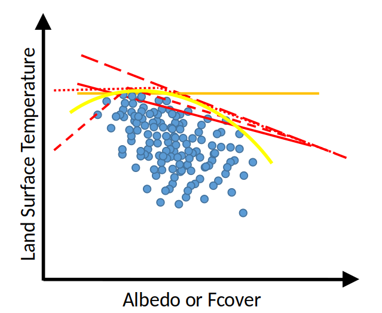

# EF model

Evaporative fraction $EF$, that represents the ratio of latent heat flux to available energy is computed
from the position of the surface temperature value respectively to the dry edge and the wet edges.
A EF model is defined by:

* the space to consider: for instance, albedo vs. temperature or fcover vs. temperature
* the method to compute the dry edge
* the method to compute the wet edge

By varying the characteristics of the EF model, we can create a wide range of models.

## Generic method to estimate edges

### Definition
The methods for estimating dry and wet edges in the literature share common mathematical basis. May it be wet or dry, an edge's shape is picked amongst six possible shapes, each with a unique mathematical function:

* Flat edges: *FlatEdge*, *FlatRegressionEdge*, *FlatPercentileEdge*
* Linear edge: *LinearEdge*
* Linear edge with threshold: *ThresholdLinearEdge*
* Linear edge with break point : *FlatLinearEdge*
* Double regression edge: *DoubleLinearEdge*
* Parabolic edge: *ParabolicEdge*

{ width="400" }
/// caption
Different dry edge types: flat edge (orange line), linear edge (red line), linear edge with threshold (dashed red line), linear edge with break point (dotted red line), double regression edge (dashed red line), parabolic edge (yellow line)
///


For flat edges, the principle is to take the maximum for dry edge (or minimum for wet edge). The extremum of the edge can be computed considering all the data (*FlatEdge*)or data in a percentile interval (*FlatPercentileEdge*) or only selected points (*FlatRegressionEdge*).

For other edges (based on piecewise polynomial regression),
the principle is to define selected points and then estimate the chosen regression. In these cases, each method divides the space (in relation to albedo or Fcover) into intervals.
It is possible to choose between intervals with same size or intervals with the same density of points.
The number of intervals can be modified according to the method being used or tile being processed.
For each interval, the objective is to define the point used to estimate the edge. Its x-axis coordinate is defined by taking the median of the points in the interval.
Its LST-axis coordinate is defined by considering a percentile of points in the interval and taking the maximum (or the minimum) or the median.
The Figure gives an example for a dry edge estimation.

{ width="400" }
/// caption
Example of dry edge
///

### Edge configuration

Therefore, an edge is characterized by:

* **type**: edge class to be chosen from the following classes:
    - *FlatEdge*
    - *FlatPercentileEdge*
    - *FlatRegressionEdge*
    - *LinearEdge*
    - *ThresholdLinearEdge*
    - *FlatLinearEdge*
    - *DoubleLinearEdge*
    - *ParabolicEdge*

* for edge based on a point selection for regression (inherited from *RegressionEdge*), a configuration **config**:
    - **interval_type**: an interval type either fixed size *size* or fixed density *density*
    - **interval_nb**: a number of intervals (for density interval type or fixed size type) or **interval_size**: a size of intervals (for fixed size type only)
    - **interval_limits**: limits for interval to consider for point selection
    - **nb_points**: number of points to considered for point selection
    - **percentile**: a percentile value to considered for point selection
    - **percentile_limit** (*optional*): the maximum number of points to be considered in the percentile interval
    - **percentile_bounds**: Percentiles used for sparse and dense intervals (logarithmic regression to compute percentile used between bounds)
    - **percentile_intervals**: Number of points to consider a sparse interval and dense intervals
    - **selection**: a regression point selection criteria (*median*,*mean*,*max*,*min*)
    - **use_breakpoint**: Use the breakpoint to compute the edge (to be used only with albedo). The mean temperature increases when
     albedo increases for low albedo values (not necessarily linearly), and the mean temperature decreases when albedo increases
     for high albedo values (linearly). The break point occurs around 0.25 and 0.3. Once the option is activated, the breakpoint
     is used to computed the edge. For *LinearEdge*, if the option use_break_point is activated, the regression occurs only on a
     part of the selected point: after the break point for top edge and before the break point for bottom edge.
     For *ThresholdLinearEdge* and *FlatLinearEdge*, if the option use_break_point is activated, the breakpoint is used as guess
     during the regression.

* for flat edge with percentile, a configuration **config**:
    - **percentile**: a percentile interval to considered for point selection
    - **percentile_limit** (*optional*): the maximum number of points to be considered in the percentile interval
    - **nb_points**: number of points to considered for point selection
    - **selection**: a regression point selection criteria (*median*,*mean*,*max*,*min*)

### Examples

* Flat edge:

```json
{
    "type": "FlatEdge"
}
```

* Flat edge with percentile:

```json
{
    "type": "FlatPercentileEdge",
    "config": {
        "percentile": 0.1,
        "selection": "median"
    }
}
```

* Linear edge:

```json
{
    "type": "LinearEdge",
    "config": {
        "interval_type": "density",
        "interval_nb": 20,
        "percentile": 5,
        "selection": "median"
    }
}
```

or

```json
{
    "type": "LinearEdge",
    "config": {
        "interval_type": "size",
        "interval_size": 0.05,
        "percentile": 5,
        "selection": "median"
    }
}
```

or

```json
{
    "type": "LinearEdge",
    "config": {
        "interval_type": "size",
        "interval_nb": 10,
        "percentile_bounds": [5,1],
        "percentile_intervals": [100,10000],
        "selection": "median"
    }
}
```

* Linear edge with threshold:

```json
{
    "type": "ThresholdLinearEdge",
    "config": {
        "interval_type": "size",
        "interval_size": 0.01,
        "percentile": 5,
        "selection": "median"
    }
}
```

 * Linear edge with break point :

```json
{
    "type": "FlatLinearEdge",
    "config": {
        "interval_type": "size",
        "interval_size": 0.01,
        "percentile": 5,
        "selection": "median"
    }
}
```

* Double regression edge:

```json
{
    "type": "DoubleLinearEdge",
    "config": {
        "interval_type": "size",
        "interval_size": 0.05,
        "percentile": 5,
        "selection": "median"
    }
}
```

* Parabolic edge:

```json
{
    "type": "ParabolicEdge",
    "config": {
        "interval_type": "size",
        "interval_size": 0.05,
        "percentile": 5,
        "selection": "median"
    }
}
```

## Generic EF model

### Configuration

A EF model is defined by:

* **name**: a name used to identified the model
* **dry_edge**: a configuration for the dry edge
* **wet_edge**: a configuration for the wet edge
* **var**: the variable to considered

### Examples
```json
{
    "name": "EF1",
    "dry_edge": {
        "type": "LinearEdge",
        "config": {
            "interval_type": "density",
            "interval_nb": 20,
            "percentile": 5,
            "selection": "median"
        }
    },
    "wet_edge": {
        "type": "LinearEdge",
        "config": {
            "interval_type": "density",
            "interval_nb": 20,
            "percentile": 5,
            "selection": "median"
        }
    },
    "var": "albedo"
}
```


```json
{
    "name": "EF8",
    "dry_edge": {
        "type": "LinearEdge",
        "config": {
            "interval_type": "density",
            "interval_nb": 20,
            "percentile": 5,
            "selection": "median"
        }
    },
    "wet_edge": {
        "type": "FlatEdge"
    },
    "var": "albedo"
}
```

### EF models configuration

In the input file, the description of EF models can be provided as a list of EF models. For instance:

```json
{
    "models": [
            {
                "name": "EF1",
                "dry_edge": {
                    "type": "LinearEdge",
                    "config": {
                        "interval_type": "density",
                        "interval_nb": 20,
                        "percentile": 2,
                        "selection": "median"
                    }
                },
                "wet_edge": {
                    "type": "LinearEdge",
                    "config": {
                        "interval_type": "density",
                        "interval_nb": 20,
                        "percentile": 2,
                        "selection": "median"
                    }
                },
                "var": "albedo"
            },
            {
                "name": "EF8",
                "dry_edge": {
                    "type": "LinearEdge",
                    "config": {
                        "interval_type": "density",
                        "interval_nb": 20,
                        "percentile": 5,
                        "selection": "median"
                    }
                },
                "wet_edge": {
                    "type": "FlatEdge"
                },
                "var": "albedo"
            }
    ]
}
```

See [EF model](#generic-ef-model) for detail to describe an EF model.

But, it is also possible to use pre-defined configuration:

- "default_evaspa"
- "hsm_evaspa"
- "avignon_evaspa"
- "global_evaspa" (Merge of HSM and Avignon configurations)

For instance

```json
{
    "models": "default_evaspa"
}
```
