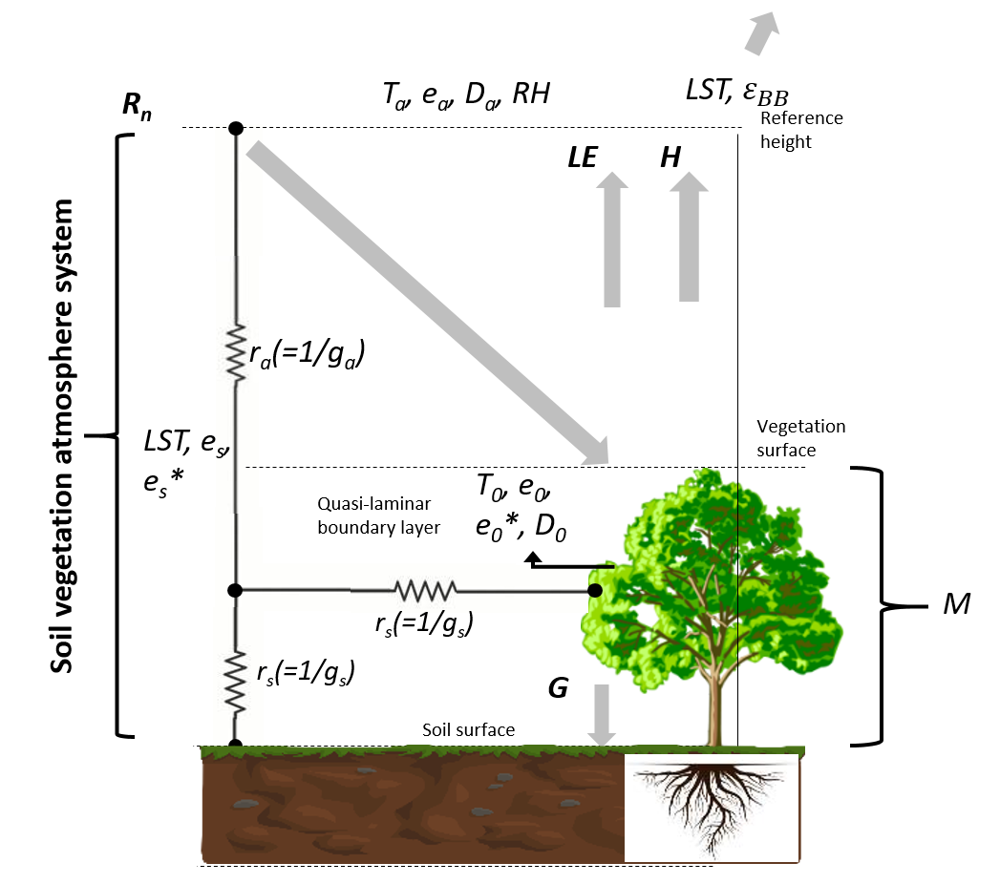
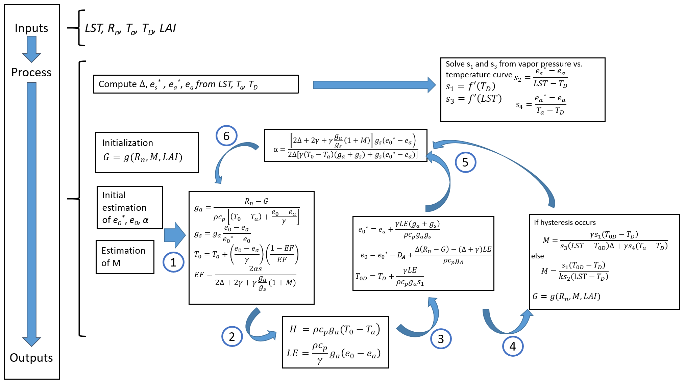

# Algorithm

## Context

The Surface Temperature Initiated Closure (STIC) algorithm is a algorithm for
computing single-pixel EvapoTranspiration (ET). 
STIC is a one-source Surface Energy Balance (SEB) model that uniquely
integrates Land Surface Temperature (LST) directly into the
 Penman-Monteith formulation. 
Introduced by [Mallick et al. 2014][1], it builds on the Penman-Monteith (PM)
formulation but is unique in its integration of land surface temperature (LST)
with aerodynamic and heat balance equations. 
This approach enables STIC to analytically determine the two key
conductances—aerodynamic conductance (ga) and surface conductance (gs)—by
deriving a closed-form equation that directly links these conductances with LST. 
In order to do so, STIC combines an LST-driven water stress index with aerodynamic
equations of H and LE and a modified complementary relationship advection-aridity
hypothesis ([Mallick et al., 2015][2]). 
The latest version of STIC (v1.3) ([Mallick et al., 2022][3]; [Hu et al., 2023][4])
combines the Shuttleworth-Wallace sparse canopy formulation model 
with the PM big-leaf model to calculate the vapor pressure at the 
source/sink height ([Shuttleworth and Wallace 1985][5]). 
The diagram of the STIC model is shown in Figure 3.

{ width="400" }
/// caption
Conceptual Diagram of the STIC model
///

## Algorithm

STIC is a zero-dimensional, simplified Soil-Vegetation-Atmosphere-Transfer (SVAT) type model designed to estimate ET using thermal infrared temperature observations.
The model considers three main biophysical state variables within the vegetation-atmosphere system: aerodynamic temperature, aerodynamic conductance, and canopy-surface conductance. The aerodynamic temperature (T0) represents the temperature at the canopy-air space or the temperature of the air moving across a bare land surface in the absence of any vegetation canopy. The temperature gradient between the land surface and the atmosphere influences the transfer of heat and moisture. Aerodynamic conductance represents the efficiency of the air in transporting water vapor and heat away from the land surface ([Trebs et al., 2021][6]). Canopy-surface conductance refers to the ability of the vegetation canopy to exchange water vapor with the atmosphere. When evaporation from the soil is negligible, gcs is interpreted as effective stomatal conductance. In STIC, the vegetation-substrate complex is considered a single unit. Therefore, the aerodynamic conductances from individual air-canopy and canopy-substrate components are regarded as an “effective” aerodynamic conductance (ga), and surface conductances from individual canopy (stomatal) and substrate complexes are regarded as an “effective” canopy-surface conductance (gs), which simultaneously regulate the exchanges of sensible and latent heat fluxes (H and LE) between the surface and atmosphere.
By integrating LST with SEB theory and vegetation biophysical principles, STIC formulates multiple state equations, eliminating the need for empirical parameterizations of the conductances and T0. Assuming the surface-atmosphere exchange operates within the available environmental and water limits, STIC estimates ET by analytically solving for T0, ga and gs from the known boundary conditions. These conditions can be retrieved from remote sensing or available from the numerical weather prediction models and include variables such as solar radiation (Rg), reflected shortwave radiation (Rr), air temperature (Ta), relative humidity (RH), vegetation index (or fractional vegetation cover), and LST ([Mallick et al., 2022][3]; [Trebs et al., 2021][6]). 
Once the conductances are analytically estimated, they are integrated into the Penman-Monteith model for direct ET estimation. The state equations relate to LST through an aggregated water stress factor (M), with the effects of LST propagated into the analytical solutions of the conductances via the water stress variable (as detailed in the Supporting Information, in [Mallick et al., 2022][3]). In STIC, the variable M serves as an indicator of moisture availability, with higher ratios imply more moisture (low water stress) and lower ratios suggest greater water stress. By utilizing the Choudhury and Monteith (1986) approach to aerodynamic vapor pressure deficit, STIC effectively bridges the gap between LST and T0, leading to more precise ET calculations ([Mallick et al., 2022][3]). This ability to directly compute ET from LST, while addressing the complexities inherent in temperature differentials, makes STIC an ideal choice for processing TRISHNA's high-resolution thermal infrared data, ultimately supporting more accurate and detailed water cycle monitoring.
The complete system equations for STIC model is represented in the figure below.

{ width="400" }
/// caption
An overview of the complete system of equations in STIC model
///

[1]: https://doi.org/10.1016/j.rse.2013.10.022 "Mallick, K. *et al.* A Surface Temperature Initiated Closure (STIC) for surface energy balance fluxes, Remote Sens. Environ., 141, 243–261, 2014."  

[2]: https://doi.org/10.1002/2014WR016106 "Mallick, K. *et al.* Reintroducing radiometric surface temperature into the Penman‐Monteith formulation. Water Resources Research, 51, 6214-6243, 2015."  

[3]: https://doi.org/10.1029/2021GL097568 "Mallick, K. *et al.* Versus Radiometric Surface Temperature Debate in Thermal-Based Evaporation Modeling Insights into the aerodynamic versus radiometric surface temperature debate in thermal-based evaporation modeling. Geophysical Research Letters, 49, 2022" 

[4]: https://doi.org/10.1029/2022WR034132 "Hu T. *et al.* Evaluating European ECOSTRESS Hub evapotranspiration products across a range of soil-atmospheric aridity and biomes over Europe. Water Resources Research, 59, 2023."

[5]: https://doi.org/10.1002/qj.49711146910 "Shuttleworth, W.J., & Wallace, J.S. Evaporation from sparse crops‐an energy combination theory. Quarterly Journal of the Royal Meteorological Society, 111, 839-855, 1985."

[6]: https://doi.org/10.1016/j.rse.2021.112602 "Trebs, I. *et al.* The role of aerodynamic resistance in thermal remote sensing-based evapotranspiration models, Remote Sensing of Environment, 264, 2021."