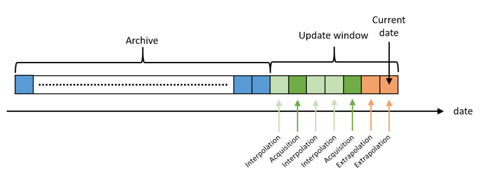
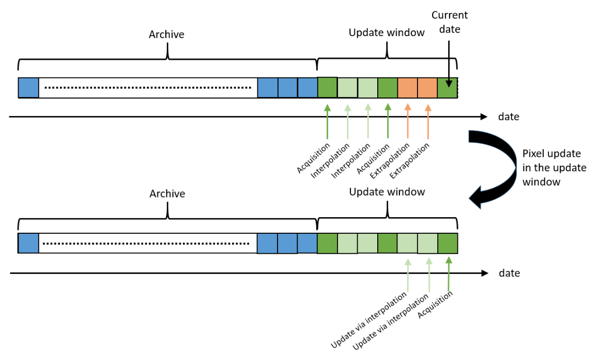

# Algorithm

## Context

Many applications of evapotranspiration require to use daily values or integrations over
larger time period from daily values. For instance, to decide if it is necessary to irrigate
a plot or not, it is necessary to estimate the root zone soil moisture or water volume.
Let's take a closer look at a continuous time series.
For each pixel, a new ET value is, each day, either supplied by ET products or calculated from ET products
at other dates and from external data.
The computation for the ET pixel value involves either interpolation techniques if
the considered date is surrounded by two acquisition dates with valid pixels or
extrapolation techniques if only a valid pixel at a previous date is available.

## Overview

We consider a sliding window of several days from the current date (typically: one week).
Within this window, the product corresponding to a date is likely to be updated thanks
to new satellite clear-sky acquisitions (see Figure “Update window”).
Once the date is no longer within the sliding window, the daily ET value
at that date can no longer evolve and the product is archived.

/// caption
Schematic diagram of the evolution of a pixel's ET time series. In the sliding window, some pixel values correspond to acquisitions (dark green), others to interpolations (light green) and others to extrapolations (orange). The value of blue pixels is archived and can no longer be updated.
///

For each new date, there are two possibilities for each pixel:

* either an ET value from a acquisition is available
* or no ET value is available, because it is a date without acquisition or the acquisition was either cloudy, of not in good conditions for an accurate estimate.

For days without available ET value, daily ET will have to be estimated with
an extrapolation of a ET value obtained from a acquisition in the previous days.
As soon as a new ET value from acquisition will be available, an update of an extrapolated values
will be computed through an interpolation procedure between two ET values corresponding
to two acquisitions surrounding the pixel date. See Figure below as illustration of the update mechanism.
Please note that the pixels for which the ET value comes from a “good quality” acquisition never need to be updated.

/// caption
Schematic diagram of the evolution of a pixel's ET time series. In the sliding window, the pixel values which have been previously extrapolated, are updated with interpolation technique. Dark green pixels correspond to cloud free acquisitions, light green pixels to interpolations and orange pixels to extrapolations. The value of blue pixels is archived and can no longer be updated.
///

Most of the processing is common. But there may be some differences,
particularly in the way processing flags are taken into account.

The following two sections detail the two possible cases:

* interpolation between two existing acquisition values
* extrapolation beyond the last previous available acquisition value
* backward extrapolation from the next available acquisition value

## Algorithms

Here is the list of algorithms available to interpolate/extrapolate ET value between acquisitions:

* Linear interpolation/extrapolation
* Interpolation taking into account re-humectation trough rainfall (not implemented yet)
